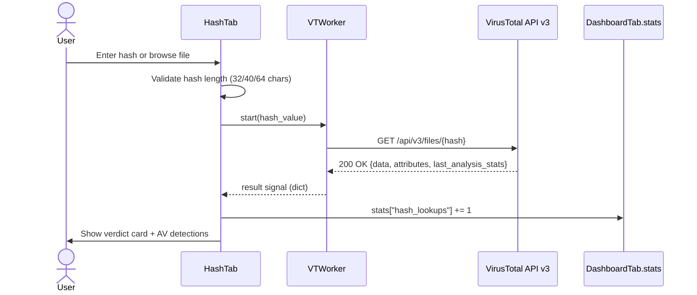

# Single Hash / File Lookup (VirusTotal)

A user submits a cryptographic hash (MD5, SHA1, or SHA256) or browses to a local file whose SHA256 is computed on the fly. The application validates the input, delegates the network call to a background worker, and renders the returned VirusTotal verdict as a color-coded card alongside a full AV-detection table. Session statistics are updated on the Dashboard so analysts can track cumulative activity across the session.

---

## User Steps

1. Navigate to the **Hash** tab in the application.
2. Either type an MD5 (32 chars), SHA1 (40 chars), or SHA256 (64 chars) hash into the input field, **or** click "Обзор файла" to open a file-picker dialog — the SHA256 of the selected file is computed locally and filled in automatically.
3. Click the **"Поиск"** button (or press Enter).
4. Wait for the result card to populate (network latency ~1–3 s on average).
5. Review the verdict card (MALICIOUS / SUSPICIOUS / CLEAN) and expand the AV detections table for per-engine results.
6. Optionally copy the hash or export the result via the context menu.

---

## System Flow

---

## Expected Outcomes

- A verdict card appears with one of three labels: **MALICIOUS** (red), **SUSPICIOUS** (orange), or **CLEAN** (green), based on `last_analysis_stats.malicious` and `suspicious` counts.
- The AV detections table lists every engine that returned a result, including category and detected name.
- `DashboardTab.stats["hash_lookups"]` is incremented by 1 and the event is appended to `stats["recent"]`.
- The status bar shows "Готово" and the search button becomes enabled again.

---

## Error States

| Error | Cause | Behavior |
|---|---|---|
| 404 Not Found | Hash not in VT database | Warning card: "Hash not found in VirusTotal" |
| 401 Unauthorized | Invalid or missing API key | Error dialog prompting user to set API key in Settings |
| 429 Too Many Requests | Free-tier rate limit exceeded | Warning banner; user advised to wait 60 s |
| Network timeout | No internet / VT unreachable | Error signal; status bar shows "Ошибка сети" |
| Invalid hash format | Wrong length / non-hex characters | Inline validation message before request is sent |

---

## Key Files Involved

| File | Role |
|---|---|
| `ui/hash_tab.py` | UI layout, input validation, result rendering, stats update |
| `workers/vt_worker.py` | Background QThread; performs the HTTP GET to VirusTotal |
| `core/hash_utils.py` | `compute_sha256(path)` used when user browses a file |
| `config.py` | Reads `VT_API_KEY` used by VTWorker |
| `ui/dashboard_tab.py` | Owns `DashboardTab.stats` class variable and `log_event()` |
