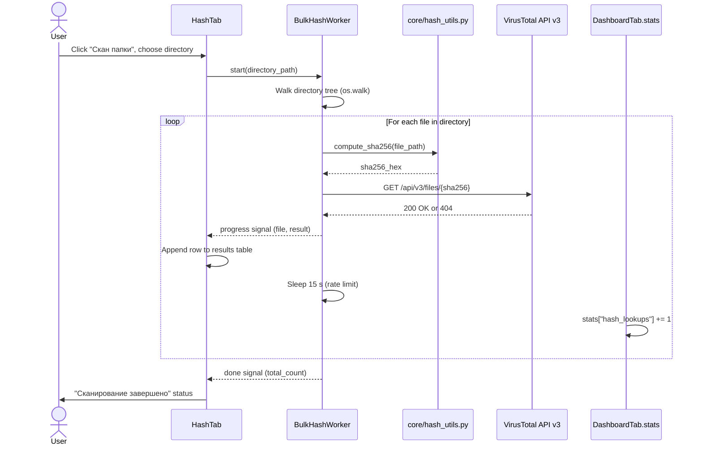

# Bulk Folder Hash Scan

An analyst needs to vet every file in a directory (e.g., a suspicious download folder or a staging area) against VirusTotal without manually entering each hash. The user points the application at a directory; `BulkHashWorker` walks the tree, computes a SHA256 for each file, and queries VirusTotal one file at a time while respecting the free-tier rate limit of 4 requests per minute (15-second inter-request delay). Results accumulate in a table so the analyst can triage at a glance.

---

## User Steps

1. Navigate to the **Hash** tab.
2. Click **"Скан папки"** to open a directory-picker dialog.
3. Select the target directory and confirm.
4. Monitor the progress bar and live log — each file's status is updated as it resolves.
5. Review the results table: file name, SHA256, verdict, detection ratio.
6. Double-click any row to open the full single-hash detail view for that file.
7. Optionally export the table to CSV via the right-click context menu.

---

## System Flow

---

## Expected Outcomes

- Every file in the selected directory has a row in the results table with its SHA256, verdict label, and detection ratio (e.g., `12/72`).
- Files returning 404 from VirusTotal are marked **UNKNOWN** in yellow — they have never been submitted.
- `DashboardTab.stats["hash_lookups"]` is incremented once per file successfully queried.
- A summary toast shows total files scanned, number malicious, number unknown.
- The scan can be cancelled mid-run via the **"Стоп"** button; already-retrieved results are preserved.

---

## Error States

| Error | Cause | Behavior |
|---|---|---|
| Directory unreadable | Permissions issue | Error dialog before scan starts |
| File read error during SHA256 | Locked / deleted file mid-scan | Row marked "Ошибка чтения"; scan continues |
| 429 Too Many Requests | Rate limit despite 15 s delay | Worker backs off an additional 30 s and retries once |
| 401 Unauthorized | Bad API key | Scan halted; error dialog shown |
| Network timeout on single file | Transient error | File marked "Timeout"; scan continues to next file |

---

## Key Files Involved

| File | Role |
|---|---|
| `ui/hash_tab.py` | "Скан папки" button, progress bar, results table rendering |
| `workers/vt_worker.py` | Contains `BulkHashWorker(QThread)` with rate-limited loop |
| `core/hash_utils.py` | `compute_sha256(path)` — streams file in 8 KB chunks to avoid large-RAM usage |
| `config.py` | Supplies `VT_API_KEY` and configurable `BULK_DELAY_SECONDS` (default 15) |
| `ui/dashboard_tab.py` | Receives incremental stat updates via `log_event()` |
