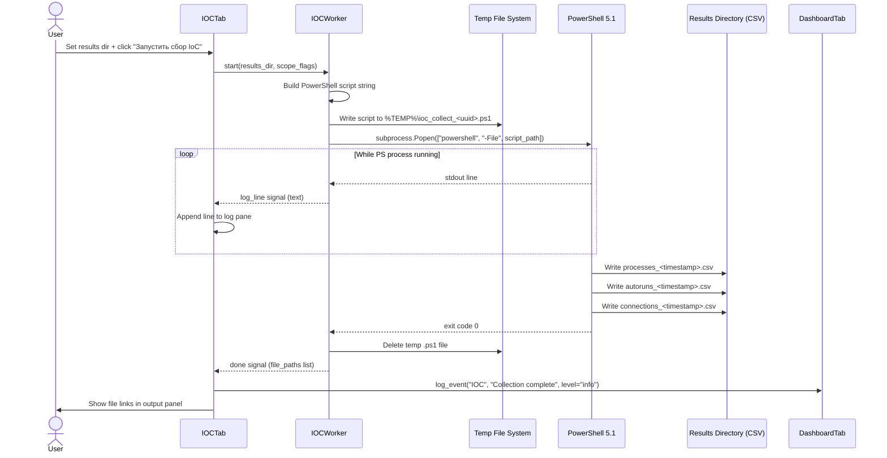

# System IOC Collection via PowerShell

When responding to an incident or performing a routine health check, an analyst uses this flow to harvest live host artifacts: running processes (with executable path validation), autorun registry keys, and active TCP connections. `IOCWorker` constructs a PowerShell script at runtime, writes it to a temp file, executes it under PowerShell 5.1, and streams log lines back to the UI in real time. Artifacts are persisted as timestamped CSV files in the analyst-specified output directory for later correlation or AI analysis.

---

## User Steps

1. Navigate to the **IOC** tab.
2. Set (or confirm) the **results directory** using the folder-picker control — this is where CSV output files will be written.
3. Optionally adjust collection scope checkboxes (Processes / Autoruns / Connections).
4. Click **"Запустить сбор IoC"**.
5. Monitor the real-time log pane as PowerShell output streams in line by line.
6. When the worker emits "done", review the three CSV files listed in the output panel.
7. Open any CSV directly from the UI, or load it into the AI Assistant tab for threat analysis.

---

## System Flow

---

## Expected Outcomes

- Three CSV files appear in the results directory within 10–30 seconds depending on system size:
  - `processes_<timestamp>.csv` — PID, Name, Path, Signed status, CPU%, Memory MB
  - `autoruns_<timestamp>.csv` — Registry key, Value name, Data (executable path)
  - `connections_<timestamp>.csv` — Local address:port, Remote address:port, State, PID, Process name
- The log pane shows line-by-line PowerShell progress with no gaps.
- The Dashboard event log records the collection as a single "IOC Collection" event with a file count.
- The temp `.ps1` script is deleted regardless of success or failure (finally block in worker).

---

## Error States

| Error | Cause | Behavior |
|---|---|---|
| PowerShell not found | PS not in PATH or wrong edition | `FileNotFoundError`; error dialog shown immediately |
| Access denied on results dir | No write permission | Worker emits error signal before launching PS |
| PS exits with non-zero code | Script-level error (registry access denied, etc.) | Error logged to pane; partial CSVs may exist |
| Process killed mid-collection | User clicks "Стоп" or timeout | Worker calls `process.terminate()`; partial CSVs saved |
| Empty output directory | No writable path set | Validation check in IOCTab before worker starts |

---

## Key Files Involved

| File | Role |
|---|---|
| `ui/ioc_tab.py` | Controls, results dir picker, real-time log pane, file link rendering |
| `workers/ioc_worker.py` | `IOCWorker(QThread)` — builds PS script, spawns subprocess, streams output |
| `ui/dashboard_tab.py` | `log_event()` called on collection complete |
| PowerShell 5.1 (system) | Executes artifact collection; writes CSVs directly to output dir |
