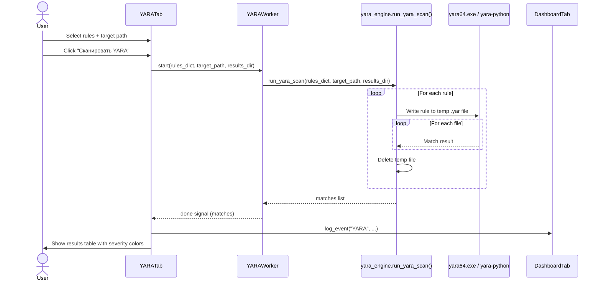

# YARA File / Folder Scanning

Analysts use YARA rules to detect malware families, exploit artifacts, or custom threat signatures across files on disk. This flow allows the user to mix built-in curated rules (selected via checkboxes) with custom `.yar` files loaded from disk. `YARAWorker` delegates execution to `yara_engine.run_yara_scan()`, which writes each rule to a temporary file and invokes either the bundled `yara64.exe` binary or the `yara-python` library. Results are surfaced in a color-coded table grouped by severity.

---

## User Steps

1. Navigate to the **YARA** tab.
2. Tick one or more built-in rule checkboxes (e.g., "Mimikatz", "Ransomware", "Webshells"), **and/or** click **"Загрузить правило"** to add a custom `.yar` file from disk.
3. Set the scan target: either a single file via "Выбрать файл" or a directory via "Выбрать папку".
4. Optionally set the results directory for saving a scan report.
5. Click **"Сканировать YARA"**.
6. Monitor the progress bar as each rule/file combination is tested.
7. Review the results table; rows are color-coded by severity (red = Critical, orange = High, yellow = Medium, grey = Info).
8. Double-click a result row to view the full matched strings and offsets.

---

## System Flow

---

## Expected Outcomes

- The results table populates with one row per match: Rule name, Severity, Matched file path, and matched string count.
- Severity is parsed from the rule's `meta.severity` field; rules without a severity tag default to "Medium".
- `DashboardTab.stats["yara_hits"]` is incremented by the total match count.
- A scan summary toast shows: "X rules checked, Y files scanned, Z matches found."
- If no matches are found, a green banner reads "Нет совпадений — файлы чисты."
- The results directory receives a timestamped `.txt` report if a results path was set.

---

## Error States

| Error | Cause | Behavior |
|---|---|---|
| No rules selected | User clicks scan without choosing any rule | Inline warning: "Выберите хотя бы одно правило" |
| No target set | Scan path field empty | Inline warning before worker starts |
| YARA syntax error | Custom `.yar` file has invalid syntax | Worker emits error for that rule; scan continues with remaining rules |
| `yara64.exe` missing | Binary not in application directory | Engine falls back to `yara-python`; warning logged |
| `yara-python` not installed | Neither binary nor library available | Fatal error dialog; user directed to reinstall |
| Access denied on target file | OS permission | File skipped; warning row added to results table |

---

## Key Files Involved

| File | Role |
|---|---|
| `ui/yara_tab.py` | Rule checkboxes, file/folder pickers, results table, severity coloring |
| `workers/yara_worker.py` | `YARAWorker(QThread)` — calls engine, emits progress/done signals |
| `core/yara_engine.py` | `run_yara_scan()` — temp file management, YARA invocation, result parsing |
| `yara64.exe` | Bundled 64-bit YARA binary (Windows); primary execution backend |
| `ui/dashboard_tab.py` | Receives `log_event("YARA", ...)` calls; updates `stats["yara_hits"]` |
| `constants.py` | Built-in rule definitions (rule text strings, severity metadata) |
