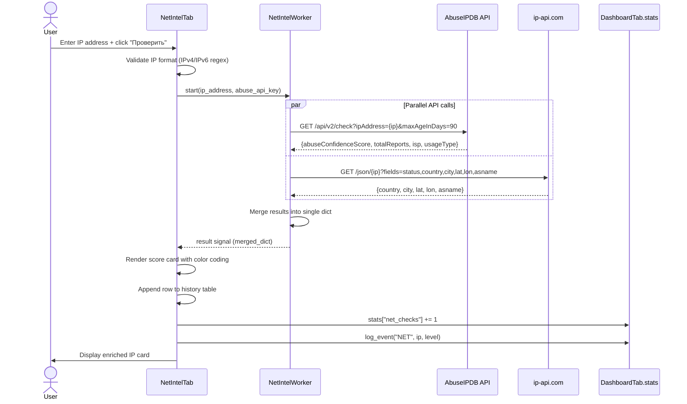

# IP / Domain Network Intelligence Lookup

During an investigation an analyst may encounter suspicious IP addresses in log files, network captures, or IOC collection output. This flow lets the analyst submit a single IP address for enrichment: `NetIntelWorker` concurrently queries AbuseIPDB for abuse-confidence score and report history, and ip-api.com for geolocation and ASN metadata. Results are combined into a single scored card and written to a persistent history table so analysts can track all IPs checked in the session.

---

## User Steps

1. Navigate to the **Network Intel** tab.
2. Paste or type an IPv4 or IPv6 address into the IP input field.
3. Click **"Проверить"** (or press Enter).
4. Wait for the score card to appear (~1–2 seconds; two parallel API calls).
5. Review the **Abuse Score** (0–100) rendered in a color-coded badge:
   - 0–24: green (Clean)
   - 25–74: yellow (Suspicious)
   - 75–100: red (Malicious)
6. Expand the "Подробности" section to see raw report count, usage type, ISP, country, and coordinates.
7. The IP is automatically added to the **History** table at the bottom of the tab.
8. Click any history row to re-load its cached result without a new network request.

---

## System Flow

---

## Expected Outcomes

- A score card appears with the abuse confidence percentage prominently displayed in a colored badge.
- The geolocation section shows country flag (if available), city, coordinates, and ASN name.
- The "Последние отчёты" count indicates how many community reports exist within 90 days.
- `DashboardTab.stats["net_checks"]` increments by 1; the event is logged with a severity level matching the badge color.
- The IP is prepended to the history table (most recent at top); the table is capped at 100 entries per session.
- Private/RFC-1918 addresses are detected client-side and flagged with an informational banner without making an API call.

---

## Error States

| Error | Cause | Behavior |
|---|---|---|
| Invalid IP format | Non-IP string entered | Inline validation message; "Проверить" stays disabled |
| 401 on AbuseIPDB | Missing or invalid API key | Score card shows "N/A" for abuse score; geolocation still shown |
| 422 Unprocessable | Reserved/private IP submitted to AbuseIPDB | Worker ignores AbuseIPDB result; shows geolocation only |
| ip-api.com failure | Rate limit (45 req/min on free tier) | Geolocation section shows "Недоступно"; abuse score still shown |
| Network timeout (either API) | No connectivity | Error card: "Не удалось получить данные — проверьте сеть" |
| Both APIs fail | Full network outage | Error dialog; no history entry written |

---

## Key Files Involved

| File | Role |
|---|---|
| `ui/net_intel_tab.py` | Input field, IP validation, score card rendering, history table |
| `workers/net_worker.py` | `NetIntelWorker(QThread)` — parallel `requests` calls, result merging |
| `config.py` | Supplies `ABUSEIPDB_API_KEY` |
| `ui/dashboard_tab.py` | `log_event()` and `stats["net_checks"]` counter |
