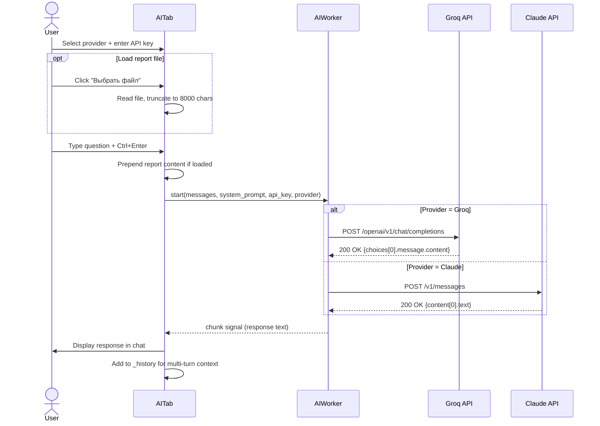

# AI Assistant — Threat Analysis Chat

The AI Assistant tab gives analysts a conversational interface to an LLM (Groq or Claude) for threat interpretation, triage guidance, and report summarization. The analyst can optionally load a CSV, TXT, or HTML report file — the first 8,000 characters are injected as system context so the model can answer questions specific to the current investigation. Conversation history is maintained across turns within a session, enabling multi-step reasoning. Quick-prompt buttons provide one-click access to common security questions.

---

## User Steps

1. Navigate to the **AI Assistant** tab.
2. Select a provider from the dropdown: **Groq** or **Claude**.
3. Enter the corresponding API key in the key field (stored in memory only; not persisted to disk).
4. Optionally click **"Выбрать файл"** to load a report file (CSV/TXT/HTML) as analysis context.
5. Type a question in the message input, or click one of the **Quick Prompts** (e.g., "Объясни результаты YARA", "Какие IOC критические?").
6. Press **Ctrl+Enter** (or click "Отправить") to submit.
7. Read the model's response as it appears in the chat window.
8. Continue the conversation — prior turns are included automatically for multi-turn context.
9. Click **"Очистить историю"** to start a fresh conversation without clearing the loaded file context.

---

## System Flow

---

## Expected Outcomes

- The model's response appears in the chat window within 2–10 seconds depending on provider and response length.
- Conversation history (`_history` list) grows with each exchange, preserving the full context for the active session.
- If a report file was loaded, the model's answers reference specific data from that file (e.g., exact process names, rule matches).
- Quick-prompt buttons remain available throughout the conversation; clicking one appends the preset question as a new user turn.
- The "Очистить историю" button resets `_history` to an empty list but does not clear the loaded file context or API key.

---

## Error States

| Error | Cause | Behavior |
|---|---|---|
| No API key entered | User clicks send without a key | Inline warning: "Введите API ключ" |
| 401 Unauthorized | Wrong API key for chosen provider | Error appended in chat: "Ошибка авторизации — проверьте ключ" |
| 429 Too Many Requests | Provider rate limit | Chat message: "Лимит запросов — повторите через N секунд" |
| Network timeout | Provider API unreachable | Error in chat; send button re-enabled |
| File too large | Loaded report > 8000 chars after truncation | Info banner: "Файл обрезан до 8000 символов" (truncation is expected behavior) |
| Empty message submitted | User presses send with blank input | Button disabled until at least 1 character is typed |
| Provider API error 5xx | Provider-side outage | Error in chat window with HTTP status code; user advised to retry |

---

## Key Files Involved

| File | Role |
|---|---|
| `ui/ai_tab.py` | Chat UI, provider selector, API key field, file loader, quick prompts, history management |
| `workers/ai_worker.py` | `AIWorker(QThread)` — routes to Groq or Claude, emits `chunk` signal with response text |
| `ui/dashboard_tab.py` | No direct write; AI tab is self-contained but can be launched from report links in Dashboard |
