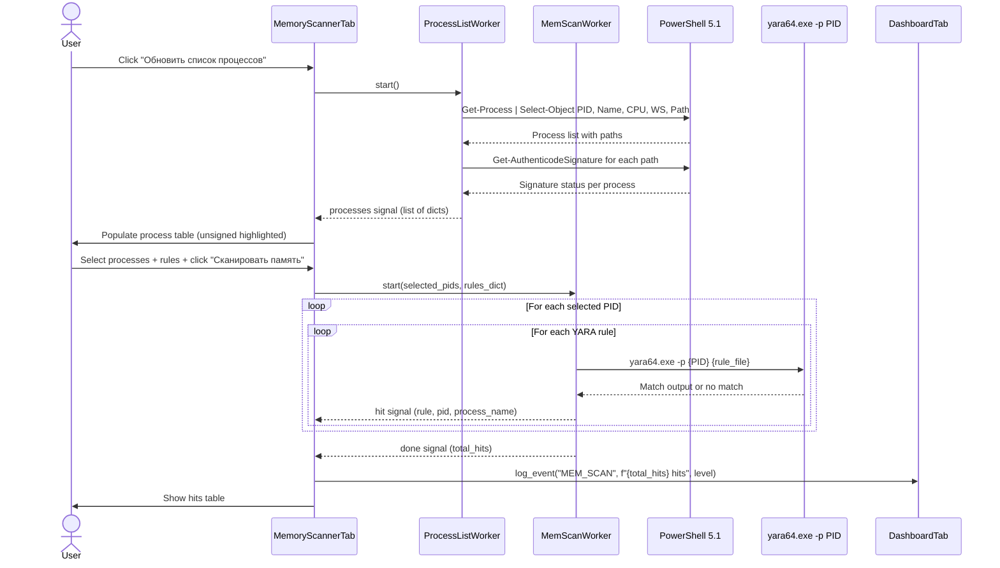

# Process Memory YARA Scanning

Memory scanning allows an analyst to apply YARA rules directly to the virtual memory of live processes without terminating or dumping them. This is critical for detecting in-memory-only malware (fileless threats, injected shellcode, reflective DLL loads) that leaves no file-system footprint. The flow has two stages: first enumerating running processes (including signature verification), then scanning selected processes with chosen YARA rules using `yara64.exe -p <PID>`.

---

## User Steps

1. Navigate to the **Memory Scanner** tab.
2. Click **"Обновить список процессов"** to enumerate all running processes — the table populates with PID, Name, CPU%, Memory (MB), and Signature status (Signed / Unsigned / Unknown).
3. Review the process list; unsigned or unknown processes are highlighted in orange as higher-priority scan targets.
4. Select one or more processes by clicking their rows (Ctrl+Click for multi-select).
5. Choose YARA rules using the same checkboxes as in the YARA tab (built-in rules) or load a custom `.yar` file.
6. Click **"Сканировать память"**.
7. Monitor the progress bar — each selected process is scanned sequentially.
8. Review the hits table: Rule name, Severity, Process name, PID, Matched region description.

---

## System Flow

---

## Expected Outcomes

- The process table refreshes within 5–15 seconds (depends on number of running processes and signature verification time).
- Signed processes show a green shield icon; unsigned show an orange warning triangle; unknown (no path resolvable) show grey.
- After scanning, the hits table shows each YARA match with severity coloring consistent with the YARA tab.
- Processes that could not be scanned (access denied — typically system/PPL processes) are marked "Доступ запрещён" and do not block the rest of the scan.
- `DashboardTab.stats["yara_hits"]` is incremented by the memory scan hit count.

---

## Error States

| Error | Cause | Behavior |
|---|---|---|
| No processes selected | Scan clicked with empty selection | Warning dialog: "Выберите хотя бы один процесс" |
| No rules selected | Scan clicked with no rules | Warning dialog: "Выберите хотя бы одно правило" |
| Access denied on process | System/PPL process or insufficient privilege | Process skipped; row marked "Доступ запрещён" |
| `yara64.exe` not found | Binary missing from app directory | Fatal error dialog before scan starts |
| PID no longer exists | Process exited between list refresh and scan | Warning in log: "Процесс {PID} завершился"; scan continues |
| Process list empty | PowerShell call failed | Error dialog; advise re-running as administrator |

---

## Key Files Involved

| File | Role |
|---|---|
| `ui/memory_scanner_tab.py` | Two-panel UI (process list + hits), rule selector, progress bar |
| `workers/process_worker.py` | `ProcessListWorker(QThread)` — PowerShell enumeration + signature check |
| `workers/yara_worker.py` | `MemScanWorker(QThread)` — iterates PID × rule combinations, calls `yara64.exe -p` |
| `yara64.exe` | Bundled binary; supports `-p <PID>` for live process memory scanning |
| `ui/dashboard_tab.py` | Receives `log_event("MEM_SCAN", ...)` on completion |
