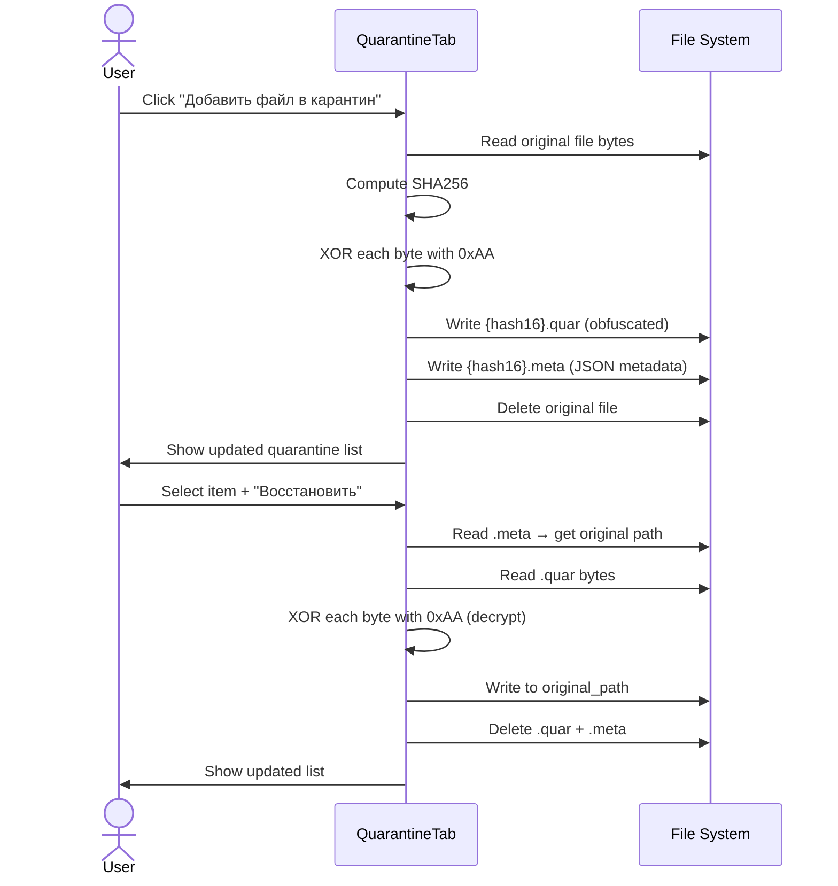

# File Quarantine Management

Quarantine provides a safe-hold mechanism for files that are confirmed or suspected malicious. Rather than deleting evidence, the file is XOR-obfuscated (key `0xAA`) and stored in a designated quarantine folder alongside a JSON metadata sidecar. This prevents accidental execution while preserving the artifact for forensic analysis, submission to sandboxes, or later restoration. All three operations (quarantine, restore, permanent delete) are handled entirely within `QuarantineTab` with no background worker — they are fast, synchronous file operations.

---

## User Steps

### Quarantine a File
1. Navigate to the **Quarantine** tab.
2. Click **"Добавить файл в карантин"** and select a file via the file-picker dialog.
3. Confirm the operation in the prompt — the original file path is shown.
4. The quarantine list updates immediately with the new entry.

### Restore a File
1. Select a row in the quarantine table.
2. Click **"Восстановить"**.
3. Confirm the restore dialog — the original path is read from the `.meta` file.
4. If the destination directory no longer exists, a second dialog asks for a new restore path.
5. The quarantine list updates; the restored file appears at its original location.

### Permanently Delete a Quarantined File
1. Select a row in the quarantine table.
2. Click **"Удалить навсегда"**.
3. Confirm the deletion warning ("Это действие нельзя отменить").
4. Both `.quar` and `.meta` files are deleted; the row is removed from the table.

---

## System Flow



---

## Metadata File Format (`.meta`)

```json
{
  "original_path": "C:\\Users\\analyst\\Downloads\\suspicious.exe",
  "original_name": "suspicious.exe",
  "sha256": "e3b0c44298fc1c149afbf4c8996fb92427ae41e4649b934ca495991b7852b855",
  "quarantine_date": "2026-05-09T14:32:00",
  "size_bytes": 204800,
  "note": ""
}
```

The first 16 hex characters of the SHA256 are used as the base filename for both `.quar` and `.meta` files to avoid collisions and obfuscate the original name.

---

## Expected Outcomes

- After quarantine: original file is gone from its source path; `.quar` + `.meta` pair exists in the quarantine folder; the table row shows filename, SHA256 prefix, date, and size.
- After restore: file appears at its original path with identical bytes (XOR is its own inverse); `.quar` and `.meta` are removed; table row disappears.
- After permanent delete: no files remain on disk for that entry; the operation is logged to the Dashboard as a "QUARANTINE_DELETE" event.
- The quarantine folder location is set in `config.py` (`QUARANTINE_DIR`) and created on first use if absent.

---

## Error States

| Error | Cause | Behavior |
|---|---|---|
| File in use (locked) | Another process holds the file open | OS error caught; dialog: "Файл используется другим процессом" |
| Quarantine dir unwritable | No write permission to quarantine folder | Error dialog before XOR operation begins |
| Original path missing on restore | Directory deleted since quarantine | Second dialog prompts for alternate restore destination |
| Duplicate hash | Same file quarantined twice | Dialog: "Файл уже в карантине"; existing entry shown |
| Corrupt `.quar` file | Partial write / manual tampering | Restore produces garbled file; warning shown |
| `.meta` file missing | Sidecar deleted manually | Restore button disabled for orphaned `.quar` entries; shown with warning icon |

---

## Key Files Involved

| File | Role |
|---|---|
| `ui/quarantine_tab.py` | All quarantine logic: XOR obfuscation/deobfuscation, `.meta` JSON read/write, table rendering, confirmation dialogs |
| `config.py` | `QUARANTINE_DIR` — path to the quarantine storage folder |
| `ui/dashboard_tab.py` | Receives `log_event("QUARANTINE", ...)` on quarantine and permanent-delete actions |
