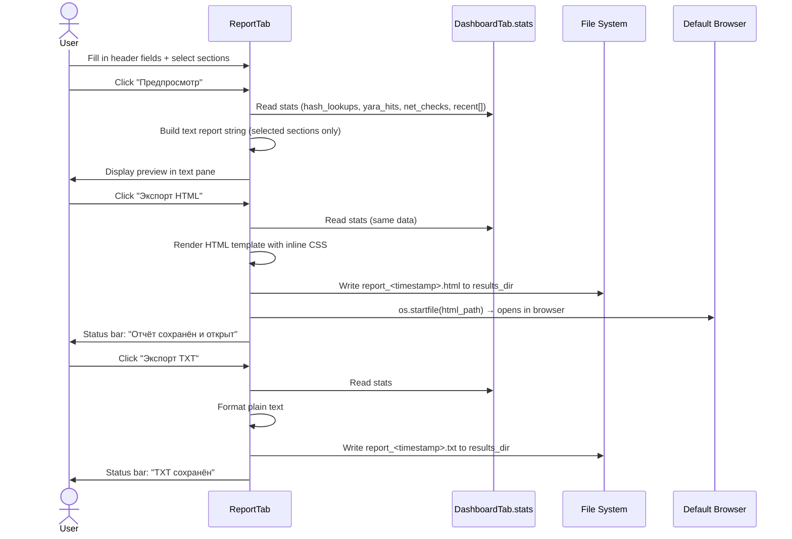

# Report Generation (HTML / TXT Export)

At the close of an investigation, the analyst consolidates all session findings into a formal report. The Report tab draws data from `DashboardTab.stats` — the central shared state that all other tabs write to throughout the session — and formats it into a structured document. The analyst can customize the report header, choose which sections to include, preview the output as plain text, and export to HTML (auto-opened in the default browser) or plain TXT.

---

## User Steps

1. Navigate to the **Report** tab.
2. Fill in the report header fields:
   - **Аналитик** — analyst name
   - **Организация** — organization / team name
   - **Заголовок отчёта** — custom report title
3. Check or uncheck the section toggles to control what is included:
   - Session statistics summary
   - Event log (all `stats["recent"]` entries)
   - YARA rule hits
   - Network intelligence results
   - Hash lookup results
4. Click **"Предпросмотр"** to render a plain-text preview in the right pane — no file is written.
5. Click **"Экспорт TXT"** to save a `.txt` file to the results directory.
6. Click **"Экспорт HTML"** to save a styled `.html` file and automatically open it in the default browser.

---

## System Flow

---

## Expected Outcomes

- The preview pane shows a complete, human-readable report within ~100 ms (no network calls; pure in-memory rendering).
- The HTML export produces a self-contained single-file report with:
  - Color-coded severity badges consistent with the rest of the UI
  - A sortable events table
  - Inline CSS (no external dependencies — works offline)
- The TXT export contains the same sections in monospace-friendly layout, suitable for pasting into ticketing systems.
- Both exports are saved with timestamps in the filename (`report_20260509_143200.html`) to avoid overwrites.
- The browser opens automatically after HTML export on Windows via `os.startfile`.

---

## Error States

| Error | Cause | Behavior |
|---|---|---|
| No results directory set | Export path field empty | Inline warning: "Укажите папку для сохранения" |
| Results dir unwritable | Permissions issue | OS error caught; error dialog with path shown |
| `os.startfile` fails | No default browser / sandboxed env | Warning: "Не удалось открыть браузер — файл сохранён по пути: ..." |
| Empty session (no data) | Report generated before any scans | Preview shows skeleton with all counters at 0; export still allowed |
| stats["recent"] very large | >200 events (cap enforced by Dashboard) | Events are capped at 200; note added to report footer |

---

## Data Sources by Section

| Report Section | Source in `DashboardTab.stats` |
|---|---|
| Session statistics | `stats["hash_lookups"]`, `stats["yara_hits"]`, `stats["net_checks"]`, `stats["ioc_collections"]` |
| Event log | `stats["recent"]` — list of dicts `{type, message, level, timestamp}` |
| YARA hits detail | Events in `stats["recent"]` where `type == "YARA"` |
| Network intel detail | Events where `type == "NET"` |
| Hash lookups detail | Events where `type == "HASH"` |

---

## Key Files Involved

| File | Role |
|---|---|
| `ui/report_tab.py` | All report UI: header fields, section toggles, preview pane, HTML/TXT rendering and export |
| `ui/dashboard_tab.py` | Owns `DashboardTab.stats` class variable; `report_tab.py` reads it directly |
| `styles.py` | Color and font constants referenced when building the inline CSS for HTML reports |
