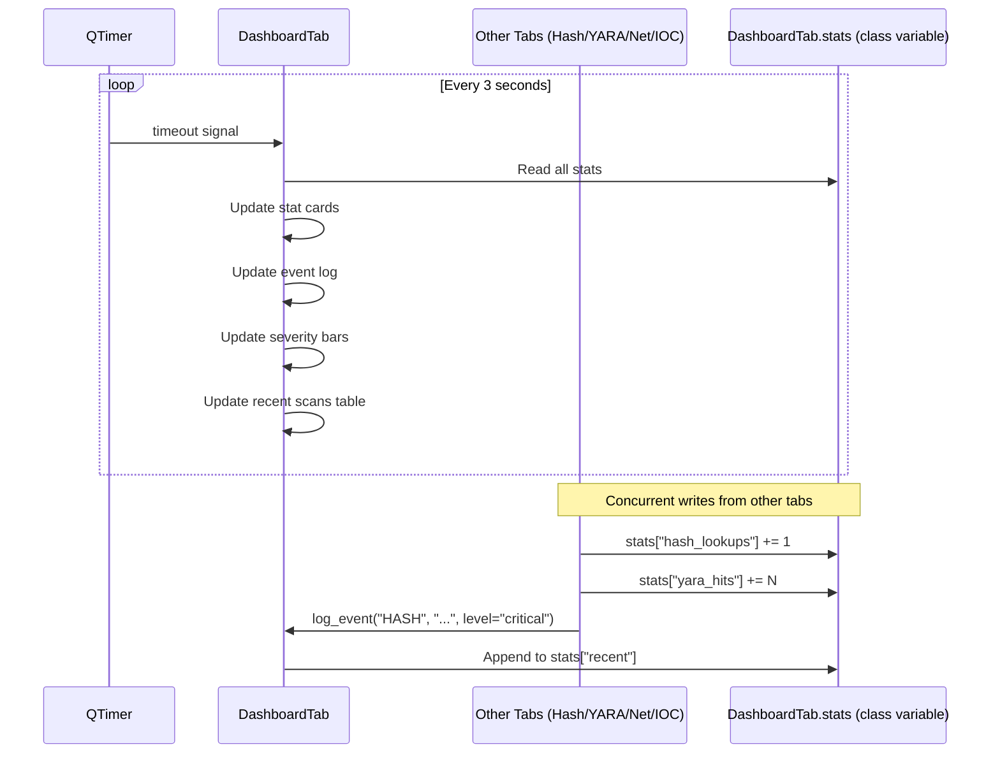

# Real-Time Dashboard Monitoring

The Dashboard tab acts as the central situational-awareness panel for the entire session. It does not initiate any scans itself — instead it passively aggregates data that all other tabs write to `DashboardTab.stats`, a class-level dictionary shared across all tab instances. A `QTimer` fires every 3 seconds to refresh all visual elements: stat cards, event log, severity distribution bars, and a recent-scans table. This polling model keeps the UI responsive while other workers are running in background threads.

---

## User Steps

1. Open the application — the **Dashboard** tab is the default landing view.
2. Observe the stat cards in the top row: Total Scans, Hash Lookups, YARA Hits, Net Checks, IOC Collections.
3. As scans run in other tabs, return to Dashboard to see counts update automatically (no manual refresh needed).
4. Scroll the **Event Log** table to review all session events with timestamps and severity labels.
5. Use the **Severity Distribution** bar chart to quickly assess the ratio of critical vs. info events.
6. Filter the event log by severity using the dropdown above the table (All / Critical / High / Medium / Info).
7. Click any event row to highlight the originating tab in the tab bar (if supported by the tab).
8. Use the **"Очистить лог"** button to reset `stats["recent"]` and all counters for a new investigation session.

---

## System Flow



---

## `DashboardTab.stats` Schema

```python
DashboardTab.stats = {
    # Scalar counters — incremented by other tabs
    "hash_lookups":    int,   # total VT hash lookups this session
    "yara_hits":       int,   # total YARA rule matches (file + memory)
    "net_checks":      int,   # total IP/domain lookups
    "ioc_collections": int,   # number of IOC collection runs
    "quarantine_count":int,   # files currently in quarantine

    # Event log — capped at 200 entries (oldest dropped)
    "recent": [
        {
            "type":      str,   # "HASH" | "YARA" | "NET" | "IOC" | "MEM_SCAN" | "QUARANTINE"
            "message":   str,   # human-readable description
            "level":     str,   # "critical" | "high" | "medium" | "info"
            "timestamp": str,   # ISO-8601 datetime string
        },
        ...
    ]
}
```

---

## Expected Outcomes

- Stat cards update within 3 seconds of any other tab incrementing a counter.
- The event log is always sorted newest-first; rows are color-coded by level (red/orange/yellow/grey).
- The severity distribution bars visually represent the proportion of critical, high, medium, and info events accumulated so far.
- The recent scans table shows the last 10 events with type icon, message, and timestamp.
- After "Очистить лог": all counters reset to 0, `stats["recent"]` becomes `[]`, and all UI elements show empty/zero state.

---

## Error States

| Error | Cause | Behavior |
|---|---|---|
| QTimer not firing | Qt event loop stalled (rare) | UI appears frozen; resolved by switching tabs to trigger repaint |
| `stats["recent"]` overflow | More than 200 events in one session | Oldest entries silently dropped; a "(truncated)" notice shown in log header |
| Race condition on stats write | Two workers write simultaneously | Python GIL provides basic protection; worst case: one counter increment lost (non-critical) |
| Dashboard opened before any scans | Normal first-run state | All counters show 0; event log shows "Нет событий"; no errors |

---

## Write Protocol for Other Tabs

All tabs that produce events **must** follow this convention to keep the Dashboard consistent:

```python
# 1. Increment the relevant scalar counter
DashboardTab.stats["hash_lookups"] += 1

# 2. Call log_event() to append to stats["recent"]
DashboardTab.log_event(
    event_type="HASH",
    message=f"SHA256 lookup: {hash_value} → MALICIOUS",
    level="critical"   # "critical" | "high" | "medium" | "info"
)
```

`log_event()` is a `@classmethod` so it can be called without holding a reference to the Dashboard widget instance.

---

## Key Files Involved

| File | Role |
|---|---|
| `ui/dashboard_tab.py` | Owns `stats` class variable; `log_event()` classmethod; `QTimer` setup; all widget update logic |
| `ui/hash_tab.py` | Writes `stats["hash_lookups"]`; calls `log_event("HASH", ...)` |
| `ui/yara_tab.py` | Writes `stats["yara_hits"]`; calls `log_event("YARA", ...)` |
| `ui/net_intel_tab.py` | Writes `stats["net_checks"]`; calls `log_event("NET", ...)` |
| `ui/ioc_tab.py` | Writes `stats["ioc_collections"]`; calls `log_event("IOC", ...)` |
| `ui/memory_scanner_tab.py` | Writes `stats["yara_hits"]`; calls `log_event("MEM_SCAN", ...)` |
| `ui/quarantine_tab.py` | Writes `stats["quarantine_count"]`; calls `log_event("QUARANTINE", ...)` |
